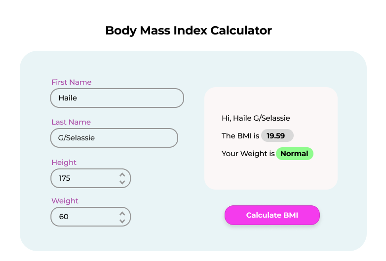

# Body Mass Index (BMI) Calculation
#### Hi Developers,
###### Your weekend task will be making a Body Mass Index (BMI) calculator.

The `UI(User Interface)` should at-least have the above graphics, the top color code will help you math the branding look. You can also get this UI in Figma file using <a href='https://www.figma.com/file/fjJG0GVLxoGolEHZaVmPph/BMI-Calculator?type=design&node-id=0%3A1&mode=design&t=5vN4H5r9JXmgNiuV-1' target='_black' >this link</a>.

All the element ` id's ` and function are provided in the pictures so that when the user enters correct information what output expected. 

Pay attention to every detail based on the result the result div style is changed.

* <u>Please Note Before</u>: use your `creativity` , this is a reference and it should not exactly match our UI but rather function the same.