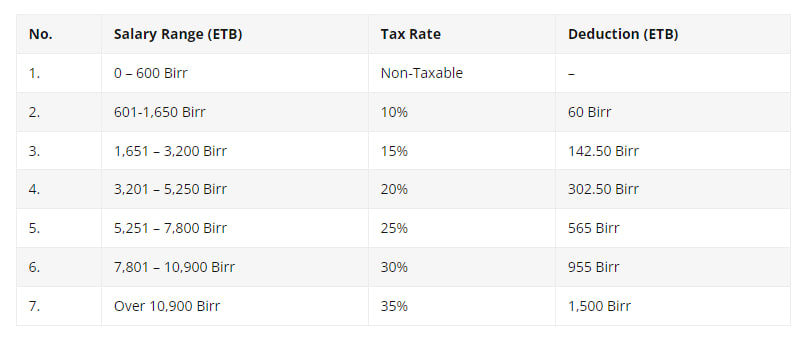

# ETH.Payroll
### Ethiopian Employee Payroll Calculator
###### Make this UI/UX and wire a JavaScript program which performs the following problems/questions.


`P1.` Using if else statement make a salary tax rate (payroll system) which accepts name and salary from the user and replies it’s tax, pension and net pay information.

`P2.` If the user select "No" from `Yes/No` option drop down pension then we set the pension to zero 

Pay attention to every detail based on the result the result div style is changed.

* <u>Please Note Before</u>: The below formula and screen-shot table of tax help you calculate the net payment.



```js
// set pension
pensionPrice = pension != 'No' ? salary * 0.07 : 0;

// calculate income tax based on tax rate
// incomeTax = (salary * taxRate) - deduction;

if(salary<= 600)
    incomeTax = 0;
else if(salary <= 1650 && salary >= 601)
    incomeTax = (salary * 0.10) - 60;
else if(salary <= 3200 && salary >= 1651)
    incomeTax = (salary * 0.15) - 142.50;
else if(salary <= 5250 && salary >= 3201)
    incomeTax = (salary * 0.20) - 302.50;
else if(salary <= 7800 && salary >= 5251)
    incomeTax = (salary * 0.25) - 565;
else if(salary <= 10900 && salary >= 7801)
    incomeTax = (salary * 0.30) - 955;
else
    incomeTax = (salary * 0.35) - 1500;

// Set net pay
netPay = salary - incomeTax - pensionPrice;
console.log(`Net Pay : ${netPay}`);