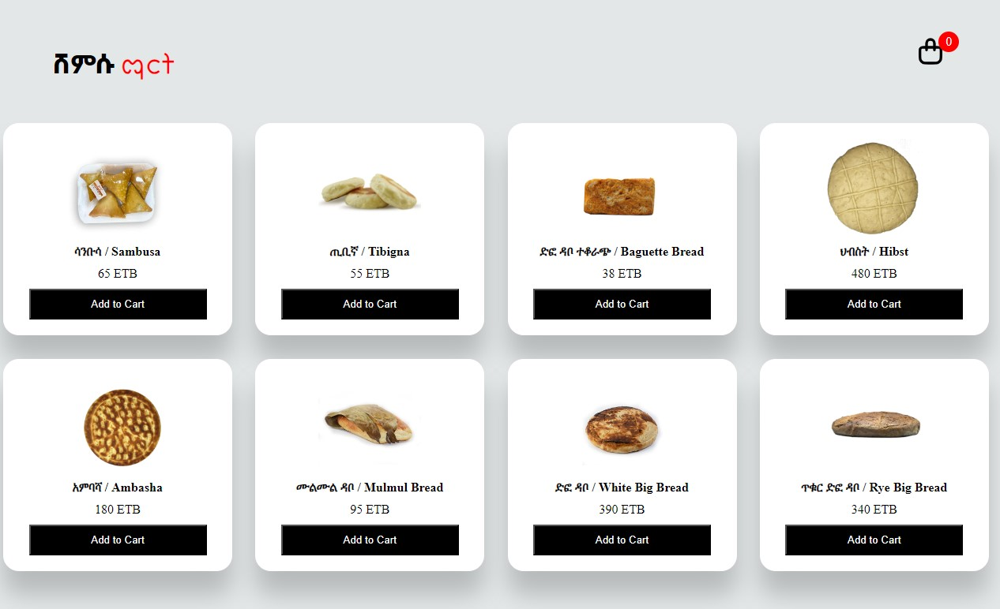
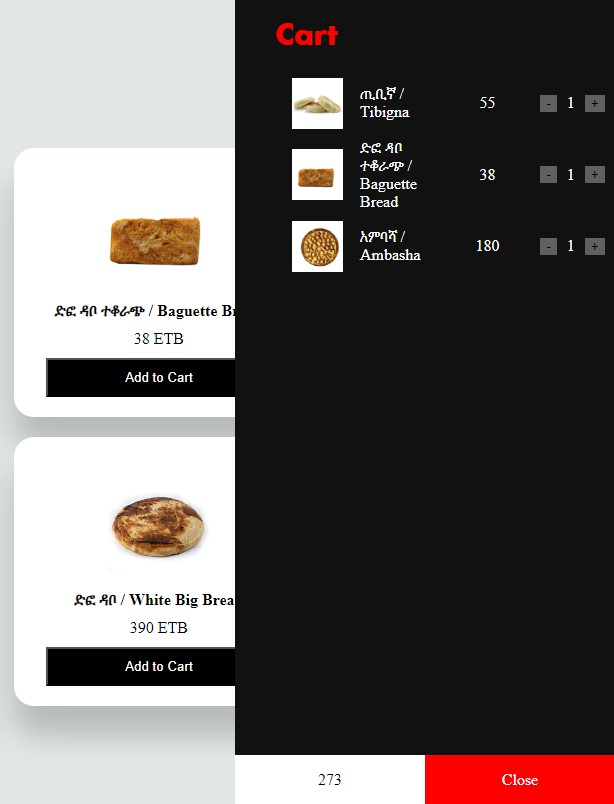

# Shopping Cart
###### A complete design of UI/UX cart with products fetch from JSON file. When the cart icon clicked it will display cart window as belows.
 

* Use this css below for reference
```css
/* Order List */
.listCart ul{
    list-style: none;
}
.listCart li{
    display: grid;
    grid-template-columns: repeat(4, 1fr);
    color: #fff;
    row-gap: 10px;
    padding-bottom: 10px;
}
.listCart li div{
    display: flex;
    justify-content: center;
    align-items: center;
}
.listCart li img{
    width: 60%;
}
.listCart li button{
    background-color: #fff5;
    border: none;
    cursor: pointer;
}
.listCart .count{
    margin: 0 10px;
}
```
After inserting this css to access `listCart` class inside the `index.html` page cart div apply the following JavaScript code to implement the functionality.

```js
let prod;
let listCarts  = [];

// Add this line inside the loop code above append function
    newDiv.innerHTML = `
        
        <div class='title'>${products[x].name}</div>
        <div class='price'>${products[x].price} ETB</div>
        <button onclick="addToCart(${x})">Add to Cart</button>`;

// This function called when we click Add to Cart: button with key parameter
function addToCart(key){
    if(listCarts[key] == null){
        // copy product from list to cart
        listCarts[key] = prod[key];
        listCarts[key].quantity = 1;
    }

    // this function calls a process which adds product to cart menu
    reloadCart();
}

// Reload cart menu slide
function reloadCart(){
    listCart.innerHTML = '';
    let count = 0;
    let totalPrice = 0;
    listCarts.forEach((value, key)=>{
        totalPrice = totalPrice + value.price;
        count = count + value.quantity;
        if(value != null){
            let newDiv = document.createElement('li');
            newDiv.innerHTML = `
                <div></div>
                <div>${value.name}</div>
                <div>${value.price.toLocaleString()}</div>
                <div>
                    <button onclick="updateQuantity(${key}, ${value.quantity - 1})">-</button>
                    <div class="count">${value.quantity}</div>
                    <button onclick="updateQuantity(${key}, ${value.quantity + 1})">+</button>
                </div>`;
                listCart.appendChild(newDiv);
        }
    })
    total.innerText = totalPrice.toLocaleString();
    quantity.innerText = count;
}

// Updates the product quantity inside the cart menu
function updateQuantity(key, quantity){
    if(quantity == 0){
        delete listCarts[key];
    }else{
        listCarts[key].quantity = quantity;
        listCarts[key].price = quantity * prod[key].price;
    }
    reloadCart();
}

```